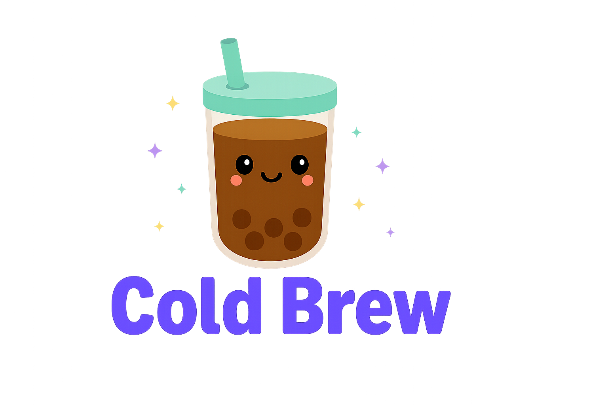

# Cold Brew

<p>

</p>

A alternative way to render [Bubble Tea](https://github.com/charmbracelet/bubbletea) TUI applications.
Cold Brew does not user an alternate buffer and has no limit to how tall the TUI application can
render. This allows the output from the TUI to stay in the history of the terminal buffer after
the TUI closes, and allows native scroll since the TUI is unbounded.


## Features

- **Full Bubble Tea Compatibility**: Any Bubble Tea Model works directly with Cold Brew's Program
- **Performance Optimized**: Efficient byte-level input processing with minimal overhead

## Installation

```bash
go get github.com/jpoz/coldbrew
```

## Quick Start

```go
package main

import (
    "fmt"
    "log"
    
    tea "github.com/charmbracelet/bubbletea"
    "github.com/jpoz/coldbrew"
)

type model struct {
    count int
}

func (m model) Init() tea.Cmd { return nil }

func (m model) Update(msg tea.Msg) (tea.Model, tea.Cmd) {
    switch msg := msg.(type) {
    case tea.KeyMsg:
        if msg.String() == "q" {
            return m, tea.Quit
        }
        m.count++
    }
    return m, nil
}

func (m model) View() string {
    return fmt.Sprintf("Key presses: %d\nPress 'q' to quit\n", m.count)
}

func main() {
    p := brew.NewProgram(model{}).WithRawMode(true)
    if err := p.Run(); err != nil {
        log.Fatal(err)
    }
}
```
